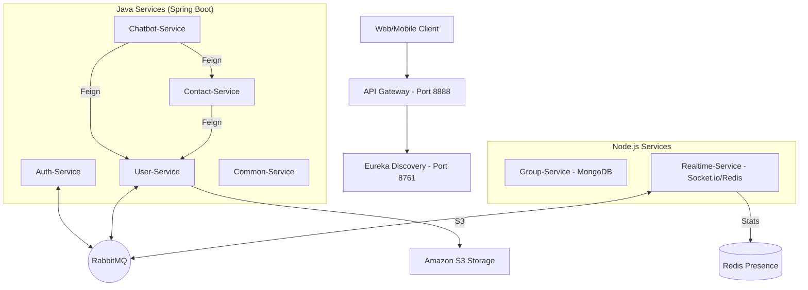

# Tài liệu Chi tiết Dự án Alo-Full-Stack

Dự án **Alo-Full-Stack** là một hệ thống ứng dụng nhắn tin hiện thực hóa theo kiến trúc **Microservices** đa ngôn ngữ (Java & Node.js). Hệ thống tập trung vào khả năng mở rộng, giao tiếp thời gian thực và tích hợp AI.

---

## 1. Kiến trúc Hệ thống (System Architecture)

Hệ thống được xây dựng dựa trên mô hình **Spring Cloud** cho cơ sở hạ tầng và kết hợp với các dịch vụ **Node.js** cho các tác vụ đặc thù như quản lý nhóm và giao tiếp thời gian thực qua WebSockets.



---

## 2. Chi tiết các Dịch vụ (Service Details)

### 2.1. Auth-Service (Port 8081)
**Nhiệm vụ**: Quản lý tài khoản, xác thực JWT, OAuth2 và Quản lý phiên (Session).

#### **Controllers & Endpoints**
*   **AuthController** (`/api/v1/auth`):
    *   `POST /send-otp`: Gửi mã OTP đăng ký.
    *   `POST /register`: Đăng ký tài khoản (Tự động kích hoạt Consumer ở User-Service).
    *   `POST /login`: Đăng nhập, cấp AccessToken (Header) & RefreshToken (Cookie).
    *   `POST /google`: Đăng nhập bằng Google.
    *   `POST /refresh`: Làm mới AccessToken.
    *   `GET /sessions`: Xem danh sách các thiết bị đang đăng nhập.
    *   `DELETE /sessions/{id}`: Đăng xuất từ xa / Xóa phiên.
*   **QrAuthController** (`/api/v1/auth/qr`):
    *   `GET /generate`: Tạo mã QR để login trên Web.
    *   `POST /verify`: Mobile quét và xác nhận.

#### **Thành phần Logic (Services)**
*   `AuthService`: Logic xử lý mật khẩu (BCrypt), tích hợp Google SDK, quản lý OTP.
*   `TokenService`: Chứa logic tạo JWT với các Claims (roles, userId, sessionId).
*   `QrAuthService`: Lưu trạng thái phiên QR vào DB.

#### **Thực thể (Entities)**
*   `Account`: id, email, phoneNumber, password, authProvider (LOCAL/GOOGLE), roles.
*   `UserSession`: id, accountId, deviceId, ipAddress, expiresAt.

---

### 2.2. User-Service (Port 8082)
**Nhiệm vụ**: Quản lý thông tin chi tiết người dùng và tích hợp lưu trữ file.

#### **Controllers & Endpoints**
*   **UserController** (`/api/v1/users`):
    *   `GET /me`: Lấy Profile cá nhân.
    *   `PUT /me`: Cập nhật Bio, giới tính, ngày sinh.
    *   `POST /me/avatar`: Upload ảnh chân dung lên S3.
    *   `POST /me/cover`: Upload ảnh bìa lên S3.
    *   `GET /search`: Tìm kiếm người dùng động (theo tên, SDT, email).

#### **Thành phần Logic (Services)**
*   `UserServiceImpl`: Xử lý CRUD. Khi Profile cập nhật, gửi sự kiện `user.updated` qua RabbitMQ.
*   `S3Service`: Wrapper cho Amazon S3 SDK (hàm `uploadFile`, `deleteFile`).
*   `UserEventConsumer`: Lắng nghe queue `user.registration.queue` từ Auth-Service để tạo Profile rỗng khi user vừa đăng ký.

#### **Thực thể (Entities)**
*   `UserProfile`: id (Map 1-1 với Account ID), firstName, lastName, avatarUrl, bio, lastActiveAt.

---

### 2.3. Contact-Service (Port 8083)
**Nhiệm vụ**: Quản lý quan hệ bạn bè (Friendships).

#### **Controllers & Endpoints**
*   **FriendshipController** (`/api/v1/contacts`):
    *   `POST /request`: Gửi lời mời kết bạn.
    *   `GET /pending`: Danh sách lời mời đang chờ.
    *   `PUT /{id}/accept`: Chấp nhận kết bạn.
    *   `DELETE /friend/{friendId}`: Xóa bạn bè.

#### **Liên kết Dịch vụ**
*   `UserClient` (Feign): Gọi qua User-Service để lấy Full Name và Avatar của bạn bè khi hiển thị danh sách.

---

### 2.4. Chatbot-Service (Port 8085)
**Nhiệm vụ**: Trợ lý AI tích hợp trực tiếp vào hệ thống chat.

#### **Cơ chế AI (Function Calling)**
Sử dụng mô hình AI kết hợp với các **Tools** để truy xuất dữ liệu real-time:
*   `UserTool`: Lấy thông tin user.
*   `ContactTool`: Kiểm tra danh sách bạn bè.
*   `GuidelineTool`: Hướng dẫn sử dụng hệ thống.

---

### 2.5. Group-Service (Node.js/TS)
**Nhiệm vụ**: Quản lý nhóm chat và thuộc tính cuộc hội thoại.

#### **Data Model (MongoDB)**
*   `Conversation`:
    *   `isGroup`: boolean (Phân biệt chat 1-1 và chat group).
    *   `members`: Array<{userId, role: LEADER/DEPUTY/MEMBER}>.
    *   `lastMessageAt`: Thời điểm tin nhắn cuối.
    *   `unreadCount`: Map<userId, number>.

#### **Logic nổi bật**
*   Quản lý quyền hạn trong nhóm (Phân quyền Trưởng/Phó nhóm).
*   Tính năng ghim (Pin) và ẩn cuộc hội thoại.

---

### 2.6. Realtime-Service (Node.js/Socket.io)
**Nhiệm vụ**: Duy trì kết nối Websocket và quản lý trạng thái Online/Offline.

#### **Socket Events**
*   `TYPING` / `STOP_TYPING`: Gửi trạng thái đang soạn tin nhắn.
*   `USER_ONLINE` / `USER_OFFLINE`: Phát thông báo trạng thái.
*   **Room Management**: Tự động Join vào các room theo `conversationId` ngay khi Connect.

---

## 3. Luồng dữ liệu chính (Data Flows)

### 3.1. Luồng Đăng ký & Khởi tạo (Event-Driven)
1.  Người dùng đăng ký tại `Auth-Service`.
2.  `Auth-Service` lưu Account và bắn sự kiện `user.registration` vào RabbitMQ.
3.  `User-Service` nhận được tin nhắn, tạo bản ghi `UserProfile` tương ứng.
4.  (Tùy chọn) `Realtime-Service` có thể phát tín hiệu chào mừng.

### 3.2. Luồng Nhắn tin Thời gian thực
1.  Client gửi tin nhắn qua `Group-Service` (để lưu DB).
2.  `Group-Service` sau khi lưu xong sẽ kích hoạt `Realtime-Service`.
3.  `Realtime-Service` xác định các thành viên trong Room và `emit` sự kiện `new_message` tới các Socket đang active.

---

## 4. Công nghệ sử dụng (Tech Stack)

*   **Backend**: Java 17+, Spring Boot 3.x, Node.js, TypeScript.
*   **Database**: MySQL/PostgreSQL (SQL), MongoDB (NoSQL), Redis (Caching/Presence).
*   **Messaging**: RabbitMQ.
*   **Cloud/Infra**: Eureka Server, API Gateway (Spring Cloud Gateway), Amazon S3.
*   **Security**: JWT (JSON Web Token), Spring Security, OAuth2.
*   **Real-time**: Socket.io.

---

## 5. Cấu trúc Thư mục Quan trọng

```text
Backend/
  ├── auth-service/     # Xác thực & Quản lý Session
  ├── user-service/     # Hồ sơ người dùng & S3
  ├── contact-service/  # Quan hệ bạn bè
  ├── chatbot-service/  # AI Chatbot
  ├── group-service/    # Quản lý Conversation/Group (Node.js)
  ├── realtime-service/ # Gateway Socket.io (Node.js)
  ├── common-service/   # Shared Library
  └── infrastructure/   # Eureka & Gateway config
```
