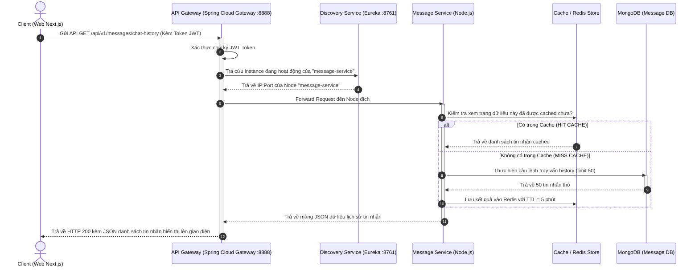

# 📊 BẢN KHẢO SÁT & TRẢ LỜI KIẾN TRÚC HỆ THỐNG - ALO CHAT SYSTEM

Tài liệu này tổng hợp câu trả lời chi tiết cho các câu hỏi liên quan đến **Kiến trúc**, **Kỹ thuật**, và **DevOps/AI** của dự án **Alo-Full-Stack**. Các câu trả lời được đúc kết trực tiếp từ cấu trúc mã nguồn thực tế của dự án, đồng thời đề xuất các hướng giải quyết/nâng cấp chuẩn chỉnh theo mô hình công nghiệp.

---

## 🏛️ PHẦN I: CÂU HỎI LIÊN QUAN ĐẾN KIẾN TRÚC

### 1. Loại kiến trúc: Dự án đang áp dụng kiến trúc nào?
* **Thực tế dự án**: Hệ thống đang áp dụng **Kiến trúc Vi dịch vụ (Microservices Architecture)** kết hợp **Định hướng sự kiện (Event-Driven Architecture)** thông qua RabbitMQ và truyền thông thời gian thực song song (Real-time Messaging) qua Socket.io & Redis.
* **Chi tiết cấu trúc thành phần**:
  * **Hạ tầng lõi (Infrastructure)**:
    * `discovery-service`: Netflix Eureka Server dùng để định danh và quản lý các node dịch vụ tự động.
    * `api-gateway`: Spring Cloud Gateway (cổng 8888) làm cổng chặn duy nhất điều phối toàn bộ các API requests từ Client xuống các service bên dưới.
  * **Các dịch vụ nghiệp vụ (Java / Spring Boot)**:
    * `auth-service`: Xác thực người dùng, cấp phát và làm mới JWT Token.
    * `user-service`: Quản lý thông tin hồ sơ cá nhân của người dùng.
    * `contact-service`: Quản lý danh bạ, lời mời kết bạn và danh sách bạn bè.
    * `report-service`: Tiếp nhận báo cáo vi phạm, lưu trữ bằng chứng (tin nhắn, hình ảnh) và hỗ trợ quản trị viên xử lý.
    * `chatbot-service`: AI Engine tích hợp Spring AI gọi API LLM để thực hiện kiểm duyệt tin nhắn (AI Moderation), tóm tắt trò chuyện (Chat Summary), tích hợp Function Calling để tra cứu tiền án vi phạm.
    * `admin-service`: Quản trị hệ thống, cấp phát cấu hình.
  * **Các dịch vụ I/O cao & Realtime (Node.js / Express / Socket.io)**:
    * `message-service`: Lưu trữ, truy vấn lịch sử tin nhắn cực nhanh.
    * `group-service`: Quản lý các nhóm chat, vai trò thành viên và cài đặt nhóm.
    * `realtime-service`: Cổng kết nối Socket.io quản lý trạng thái online/offline, thông báo đẩy, typing indicator và nhắc hẹn thời gian thực.
    * `voting-service`: Xử lý tạo và bình chọn (poll) trong nhóm chat.

### 2. Lý do lựa chọn kiến trúc này cho hệ thống?
* **Phân rã nghiệp vụ**: Tách biệt luồng Chat I/O tốc độ cao (Node.js) ra khỏi các nghiệp vụ mang tính giao dịch và bảo mật cao như Auth, Report, Admin (Spring Boot).
* **Phát triển song song (Parallel Development)**: Dự án có 5 thành viên (`hoangtan22th`, `TanDuy274`, `tVhowww`, `NhatDuonq`, `hj3j`). Việc chia nhỏ thành các dịch vụ độc lập giúp mỗi thành viên phụ trách một vài repository/module riêng biệt mà không bị xung đột code (git conflict) khi merge.
* **Khả năng cô lập lỗi (Fault Isolation)**: Nếu dịch vụ `chatbot-service` hoặc `voting-service` bị quá tải hoặc sập, luồng chat cơ bản 1-1, chat nhóm và đăng nhập hệ thống vẫn diễn ra bình thường.
* **Tối ưu hóa tài nguyên (Independent Scaling)**: Dịch vụ `message-service` và `realtime-service` chịu tải cao nhất từ hàng triệu kết nối đồng thời có thể dễ dàng scale lên nhiều replica bằng Docker/Kubernetes mà không tốn RAM/CPU cho các dịch vụ ít khi gọi như `report-service`.

### 3. Thuộc tính chất lượng (Quality Attributes)
* **Availability (Độ khả dụng)**: 
  * Áp dụng cơ chế **Fallback** (Feign Client Fallback) khi các dịch vụ gọi nhau qua REST HTTP. 
  * Tận dụng RabbitMQ Queue làm vùng đệm cho các tác vụ nặng (như kiểm duyệt bằng chứng report bằng AI). Nếu AI Engine tạm thời sập, tin nhắn sự kiện vẫn nằm an toàn trong Queue và sẽ tự động được xử lý lại khi hệ thống AI hồi phục.
* **Scalability (Khả năng mở rộng)**:
  * Sử dụng **Redis Pub/Sub** làm cầu nối chia sẻ sự kiện giữa nhiều node `realtime-service` chạy song song. Khi Client A kết nối tới Node 1 gửi tin cho Client B đang kết nối tới Node 2, Redis sẽ đồng bộ sự kiện để Node 2 đẩy socket kịp thời.
  * Tích hợp **Eureka Discovery Service** giúp các dịch vụ tự động đăng ký địa chỉ IP/Port và API Gateway tự động cân bằng tải (Round Robin) mà không cần cấu hình cứng.
* **Security (Bảo mật)**:
  * Xác thực tập trung thông qua Gateway bằng JWT token. Gateway tự động lọc và xác thực chữ ký của token trước khi chuyển request tiếp tục đi xuống các dịch vụ nội bộ (Downstream Services).
  * Ẩn giấu hoàn toàn các API vi dịch vụ đằng sau mạng nội bộ (Internal Virtual Network) của Docker, chỉ mở cổng Gateway (8888) ra ngoài Internet.
* **Maintainability (Khả năng bảo trì)**:
  * Mỗi dịch vụ có một cấu trúc dự án riêng biệt, dễ dàng viết các bộ kiểm thử tự động (Unit Test, Integration Test) độc lập.

### 4. Quản lý phụ thuộc (Dependency Management)
* **Trong nội bộ mã nguồn**: Áp dụng triệt để nguyên lý **Dependency Injection (DI)** thông qua Spring IoC Container đối với Java (sử dụng `@Autowired`, constructor injection) và các hooks/store quản lý trạng thái tập trung (Zustand) ở phía Web Client Next.js / Mobile React Native.
* **Giữa các dịch vụ (Inter-service Dependency)**:
  * **Liên kết đồng bộ (Synchronous)**: Sử dụng **Spring Cloud OpenFeign** để các dịch vụ Java gọi nhau qua HTTP REST API (ví dụ: `report-service` gọi Feign đến `chatbot-service`).
  * **Liên kết bất đồng bộ (Asynchronous - Loosely Coupled)**: Sử dụng **RabbitMQ** để đẩy các tin nhắn sự kiện bất đồng bộ nhằm giảm thiểu sự phụ thuộc trực tiếp giữa các dịch vụ, tránh hiện tượng thắt nút cổ chai và tăng tốc phản hồi cho người dùng.

### 5. Tính nhất quán dữ liệu (Data Consistency)
* **Polyglot Persistence (Lưu trữ đa dạng)**: 
  * Sử dụng **MariaDB (SQL)** cho các miền dữ liệu cần đảm bảo toàn vẹn giao dịch ACID cao (như thông tin tài khoản, danh bạ bạn bè tại `contact-service` và `auth-service`).
  * Sử dụng **MongoDB (NoSQL)** cho các dữ liệu dạng tài liệu phi cấu trúc hoặc có tần suất ghi cực lớn (tin nhắn `message-service`, báo cáo vi phạm `report-service`).
* **Cơ chế đảm bảo nhất quán**:
  * Hệ thống chấp nhận tính chất **Eventual Consistency (Nhất quán sau cùng)** thông qua RabbitMQ đối với các luồng nghiệp vụ chạy nền.
  * *Ví dụ thực tế*: Khi Admin bấm phán quyết khóa tài khoản người dùng tại Dashboard của `admin-service`, một sự kiện `auth.ban` được phát qua RabbitMQ. Dịch vụ `realtime-service` nhận được sự kiện này sẽ ngắt kết nối Socket của người dùng đó sau 500ms, đồng thời cập nhật trạng thái hoạt động về offline, dữ liệu được cập nhật đồng bộ sau một vài mili-giây trên toàn hệ thống mà không cần dùng Transaction phân tán nặng nề.

### 6. Luồng đi của Request (Request Flow)
Dưới đây là sơ đồ chi tiết luồng xử lý của một Request từ Giao diện đến Cơ sở dữ liệu:

### 7. Giải pháp bộ nhớ đệm (Caching)
* **Công nghệ lựa chọn**: **Redis** làm bộ nhớ đệm và lưu trữ cấu trúc dữ liệu tạm thời trong RAM.
* **Lý do sử dụng**:
  * Tốc độ đọc/ghi dữ liệu trong RAM cực cao (~100,000 requests/giây).
  * Dùng để lưu trữ **Typing Status** (trạng thái đang nhập văn bản) của người dùng tạm thời thay vì ghi trực tiếp vào DB gây quá tải.
  * Đồng bộ hóa session socket thời gian thực giữa nhiều instance Server chạy song song.
* **Chiến lược lưu và xóa cache**:
  * **Cache-Aside Pattern (Lazy Loading)**: Dữ liệu được đọc từ Redis trước. Nếu không có (Miss), hệ thống sẽ truy vấn từ DB, lưu ngược lại vào Redis kèm theo thời gian hết hạn **TTL (Time-To-Live)** phù hợp (thường là 5 - 15 phút) để tránh làm tràn bộ nhớ RAM.
  * **Composite Hashing Cache (Ứng dụng trong Z-Shield AI Moderation)**:
    * Hệ thống mã hóa MD5/SHA-256 từ `Reason` + `MessageSnapshots` của báo cáo để sinh ra một chuỗi Hash độc nhất đại diện cho bằng chứng vi phạm.
    * Khi có báo cáo mới gửi lên, hệ thống kiểm tra nhanh trong MongoDB/Redis xem đã có báo cáo nào trùng mã băm này được phân tích AI chưa.
    * Nếu **HIT CACHE**: Sao chép kết quả AI có sẵn chỉ trong 2ms.
    * Nếu **MISS CACHE**: Gọi dịch vụ OpenAI qua Spring AI (tốn 3 - 5 giây và chi phí token), sau đó lưu kết quả vào DB để làm cache cho các báo cáo spam tiếp theo.

### 8. Đánh đổi kiến trúc (Architectural Trade-offs & Bottlenecks)
* **Độ phức tạp vận hành (Operational Complexity)**: Khởi chạy và giám sát hơn 12 microservices khác nhau đòi hỏi tài nguyên máy phát triển cực lớn và cấu hình phức tạp.
* **Độ trễ mạng (Network Latency)**: Việc gọi liên dịch vụ qua OpenFeign (HTTP REST) hoặc qua API Gateway tạo ra nhiều chặng mạng (network hops), làm tăng tổng độ trễ xử lý của một request so với kiến trúc Monolith đơn thể.
* **Nhất quán sau cùng (Eventual Consistency)**: Dữ liệu giữa các dịch vụ đồng bộ bất đồng bộ qua RabbitMQ có thể bị lệch trong khoảng vài mili-giây, yêu cầu Client Frontend phải thiết kế giao diện linh hoạt (Optimistic UI) để tránh hiển thị sai lệch thông tin cho người dùng.

---

## 💻 PHẦN II: CÂU HỎI LIÊN QUAN ĐẾN KỸ THUẬT

### 1. Design Patterns áp dụng trong dự án
* **Singleton Pattern**: Được áp dụng mặc định cho toàn bộ các Service, Repository, Controller beans quản lý bởi Spring Container và các instance Client kết nối cơ sở dữ liệu/socket trong Node.js.
* **Builder Pattern**: Sử dụng thư viện Lombok (`@Builder`) trên các Model và DTOs để khởi tạo đối tượng sạch sẽ, tránh việc dùng quá nhiều Constructor chồng chéo.
* **Observer Pattern**: Áp dụng trong cơ chế lắng nghe sự kiện của Socket.io (`on("message", ...)`), RabbitMQ Listener (`@RabbitListener`), tự động kích hoạt hành động tương ứng khi có sự kiện xuất hiện.
* **Proxy Pattern**: Spring Cloud OpenFeign tự động tạo ra các đối tượng dynamic proxy bọc quanh các interface Feign Client để thực hiện các cuộc gọi HTTP REST ngầm mà lập trình viên không cần viết mã thủ công.
* **Strategy Pattern**: Dùng để cấu hình linh hoạt các hành vi lọc/kiểm duyệt tin nhắn AI. Tùy thuộc vào loại báo cáo (`SCAM`, `TOXIC`, `GAMBLING`), Prompt và bộ lọc quy chuẩn tương ứng sẽ được áp dụng động.

### 2. CQRS (Command Query Responsibility Segregation)
* **Trạng thái hiện tại**: Hệ thống chưa áp dụng mô hình CQRS hoàn chỉnh ở mức chia đôi Database vật lý (Master/Slave chuyên biệt cho đọc ghi). Tuy nhiên, dự án có áp dụng **Sự tách biệt luồng xử lý ở tầng mã nguồn**:
  * **Nhánh Ghi (Command)**: Chạy qua các API POST/PUT/DELETE trực tiếp xuống database giao dịch để đảm bảo dữ liệu ghi đúng, ghi đủ và bảo vệ toàn vẹn dữ liệu.
  * **Nhánh Đọc (Query)**: Sử dụng các API GET tối ưu hóa, kết hợp đọc từ cache Redis hoặc tạo ra các DTOs tối giản để trả thẳng dữ liệu về giao diện mà không chạy qua các logic validation nghiệp vụ phức tạp của luồng Ghi.
* **Hướng giải quyết / Nâng cấp lên CQRS thực thụ**:
  * Tách cơ sở dữ liệu làm 2 phần:
    1. **Write DB (MariaDB/PostgreSQL)**: Chỉ nhận các câu lệnh CUD, đảm bảo chuẩn hóa dữ liệu tối đa.
    2. **Read DB (Elasticsearch hoặc MongoDB đã phi chuẩn hóa)**: Chỉ chứa dữ liệu được tối ưu sẵn phục vụ hiển thị.
  * Cấu hình công cụ **Debezium (Change Data Capture - CDC)** kết hợp với **Kafka/RabbitMQ** để lắng nghe sự thay đổi ở Write DB và đồng bộ hóa bất đồng bộ sang Read DB theo thời gian thực.

### 3. Event Sourcing
* **Trạng thái hiện tại**: Dự án **chưa áp dụng** Event Sourcing. Hệ thống hiện tại đang cập nhật ghi đè trạng thái cuối cùng (State Mutation) trực tiếp vào các tài liệu MongoDB hoặc các hàng dữ liệu MariaDB.
* **Hướng giải quyết / Hướng đi nếu muốn áp dụng**:
  * Thay vì cập nhật trực tiếp bảng `reports` sang trạng thái `RESOLVED`, hệ thống sẽ ghi nhận một chuỗi các sự kiện bất biến vào một **Event Store**:
    1. `ReportCreatedEvent` (Dữ liệu ban đầu)
    2. `ReportLockedByAdminEvent` (Admin khóa xử lý)
    3. `ReportAiAnalyzedEvent` (AI trả về kết quả gợi ý)
    4. `ReportResolvedEvent` (Admin đưa ra quyết định khóa tài khoản)
  * Trạng thái cuối cùng của báo cáo được khôi phục (reconstitute) bằng cách đọc toàn bộ chuỗi sự kiện trên và chạy lại (replay) chúng từ đầu đến cuối. Phương pháp này giúp lưu trữ lịch sử kiểm toán (Audit Trail) hoàn hảo 100% không thể sửa xóa.

### 4. Sync/Async: Thành phần nào xử lý đồng bộ, bất đồng bộ?
* **Xử lý Đồng bộ (Synchronous - Blocking)**:
  * Đăng nhập, đăng ký và xác thực tài khoản qua cổng Gateway.
  * Các cuộc gọi liên dịch vụ HTTP thông qua Feign Client để lấy thông tin tức thời (như `chatbot-service` gọi Feign sang `report-service` lấy số lần vi phạm cũ để LLM nâng khung hình phạt).
* **Xử lý Bất đồng bộ (Asynchronous - Non-blocking)**:
  * **Hệ thống RabbitMQ Broker**: Nhận sự kiện `report.created` và đẩy vào hàng đợi `report.ai.analyze.queue`. Worker chạy ngầm sẽ tiêu thụ tin nhắn này và phân tích AI độc lập mà không bắt Admin hay Client phải đứng chờ phản hồi.
  * **Socket.io Events**: Các sự kiện thời gian thực như `typing`, `presence` (online/offline), gửi tin nhắn nhanh, hoặc đẩy thông báo nhắc hẹn đều được truyền phát bất đồng bộ qua giao thức WebSockets.

### 5. Database Migration
* **Trạng thái hiện tại**: 
  * Phía các dịch vụ Spring Boot sử dụng cấu hình tự động của JPA Hibernate: `spring.jpa.hibernate.ddl-auto: update`. Cấu hình này giúp tự động so sánh các Class Entity với cấu trúc bảng MariaDB và tự động thêm các cột mới khi khởi động ứng dụng.
* **Hạn chế**: `ddl-auto: update` dễ gây lỗi bất tương thích dữ liệu trên môi trường Production, không thể rollback cấu trúc dữ liệu cũ và khó theo dõi lịch sử thay đổi DB giữa các thành viên.
* **Hướng giải quyết / Nâng cấp**:
  * Tích hợp **Flyway Migration** vào các dịch vụ Java/Spring Boot.
  * Tạo thư mục `src/main/resources/db/migration` lưu trữ các tệp SQL phiên bản tăng dần:
    * `V1__init_auth_tables.sql`
    * `V2__add_snapshot_hash_to_reports.sql`
  * Khi ứng dụng khởi chạy, Flyway sẽ tự động đọc bảng lịch sử `schema_version` và chỉ chạy các file migration mới, đảm bảo 100% tất cả các máy của lập trình viên và server thật đều có cấu trúc DB đồng nhất hoàn hảo.

---

## 🐳 PHẦN III: CÂU HỎI LIÊN QUAN ĐẾN DEVOPS & AI

### 1. CI/CD: Quy trình tự động hóa kiểm thử và triển khai
* **Trạng thái hiện tại**: Dự án đang được chạy thủ công hoặc bán tự động trên môi trường phát triển cục bộ (Local Development Environment).
* **Hướng giải quyết / Xây dựng hệ thống CI/CD chuẩn**:
  * **CI (Continuous Integration) với GitHub Actions**:
    * Tạo file `.github/workflows/ci.yml` kích hoạt mỗi khi có pull request hoặc push lên nhánh `dev-2`/`main`.
    * Tự động khởi chạy môi trường kiểm thử (JUnit tests cho Spring Boot, Jest tests cho Node.js).
    * Chạy kiểm tra chất lượng code bằng SonarQube để quét lỗi bảo mật.
  * **CD (Continuous Deployment)**:
    * Sau khi CI pass, hệ thống tự động build Docker Image cho từng microservice và đẩy lên **Docker Hub** hoặc **AWS ECR**.
    * Sử dụng SSH để kết nối tự động đến VPS (EC2/DigitalOcean), kéo các Docker Image mới nhất về và chạy lệnh khởi động lại container (`docker compose up -d`) không gây gián đoạn dịch vụ.

### 2. Containerization: Đóng gói ứng dụng bằng Docker
* **Trạng thái hiện tại**: Các dịch vụ đã được chuẩn bị để đóng gói bằng Docker và cấu hình thông qua môi trường biến số (environment variables).
* **Hướng giải quyết / Cấu hình chuẩn Dockerization**:
  * Viết tệp `Dockerfile` đa tầng (Multi-stage build) để tối ưu dung lượng ảnh cho từng dịch vụ:
    * *Với Spring Boot (Java)*: Tầng 1 sử dụng Maven để build ra file `.jar`, Tầng 2 sử dụng lightweight runtime OpenJDK-alpine chạy file `.jar` đó (giúp dung lượng image giảm từ 800MB xuống 150MB).
    * *Với Node.js*: Tầng 1 build/transpile TypeScript sang JS, Tầng 2 chỉ cài đặt `dependencies` production và chạy bằng NodeJS-alpine.
  * Xây dựng tệp cấu hình **`docker-compose.yml`** đặt tại thư mục gốc của dự án chứa toàn bộ hạ tầng:
    * Khai báo các service hạ tầng: `mariadb`, `mongodb`, `redis`, `rabbitmq`, `eureka-server`.
    * Khai báo các microservices nghiệp vụ kết nối với nhau thông qua mạng ảo nội bộ (bridge network). Thiết lập thứ tự khởi động bằng thuộc tính `depends_on`.
    * Chỉ cần chạy duy nhất câu lệnh `docker-compose up --build -d` là toàn bộ hệ thống 12 dịch vụ khởi chạy đồng loạt trên mọi máy tính.

### 3. Monitoring: Cơ chế giám sát hiệu năng và Log hệ thống
* **Trạng thái hiện tại**: Giám sát thủ công bằng cách đọc log trực tiếp từ màn hình terminal hoặc các tệp tin xuất log thô.
* **Hướng giải quyết / Xây dựng hệ thống Giám sát chuẩn**:
  * **Thu thập chỉ số hiệu năng (Metrics Monitoring)**:
    * Kích hoạt **Spring Boot Actuator** kết hợp **Micrometer** trên các ứng dụng Java để xuất các chỉ số hiệu năng dưới định dạng chuẩn Prometheus.
    * Khởi chạy một container **Prometheus** để định kỳ thu thập (scrape) chỉ số từ tất cả microservices.
    * Kết nối Prometheus với **Grafana** để thiết lập Dashboard trực quan theo dõi lượng tải RAM, CPU, số lượng request/giây, thời gian phản hồi API và vẽ biểu đồ cảnh báo khi có sự cố.
  * **Thu thập Log tập trung (Log Aggregation)**:
    * Khởi chạy hệ thống **Loki** kết hợp **Promtail** (hoặc ELK Stack: Elasticsearch - Logstash - Kibana).
    * Cấu hình các dịch vụ ghi đè log ra console dưới dạng JSON. Promtail sẽ gom toàn bộ các dòng log này gửi về Loki Server.
    * Quản trị viên chỉ cần truy cập Grafana Loki để tra cứu lỗi của tất cả 12 dịch vụ tại một màn hình duy nhất, lọc theo thời gian hoặc tên dịch vụ thay vì SSH vào từng máy chủ để đọc tệp log thô.

### 4. AI Integration: Tích hợp trí tuệ nhân tạo vào kiến trúc phần mềm
Dự án **Alo-Full-Stack** sở hữu các điểm sáng vượt trội trong việc tích hợp AI sâu vào kiến trúc dịch vụ vi mô, bao gồm:
* **NLP Parser Tiếng Việt tự động trích xuất Nhắc Hẹn**:
  * Phát triển bộ phân tích cú pháp ngôn ngữ tự nhiên tiếng Việt [reminderParser.ts](file:///e:/2_CHUONG_TRINH_NAM%204_HK2/Alo-Full-Stack/Web/alo-chat-2/src/utils/reminderParser.ts) ngay tại Client nhằm phát hiện nhanh các tín hiệu thời gian dạng tự do (`ngày mai 12h`, `hôm nay 15h30`, `thứ hai tuần sau 14h`).
  * Hệ thống làm sạch nội dung tin nhắn để điền sẵn Form nhắc hẹn một cách thông minh, nâng cao UX vượt bậc.
* **AI Moderation Engine với Spring AI & OpenFeign**:
  * Tận dụng thư viện **Spring AI** trong `chatbot-service` để gọi API đến mô hình OpenAI/Gemini phục vụ kiểm duyệt tin nhắn lừa đảo.
  * Triển khai mô hình **Spring AI Function Calling**:
    * Trong quá trình LLM phân tích nội dung báo cáo vi phạm, AI sẽ tự động kích hoạt một công cụ (Tool) lập trình sẵn mang tên `countTargetViolations`.
    * Công cụ này gọi Feign Client ngược lại `report-service` để đếm số lần vi phạm pháp luật trong lịch sử (tiền án) của đối tượng bị báo cáo.
    * LLM nhận được tham số lịch sử này từ hệ thống, tự động đưa vào ngữ cảnh Prompt để nâng mức hình phạt đề xuất từ cảnh cáo lên khóa tài khoản vĩnh viễn (`BAN`), đảm bảo tính chính xác và khách quan cao.
* **Chat Summary (Tóm tắt hội thoại)**:
  * LLM đọc toàn bộ bằng chứng tin nhắn snapshot đính kèm trong báo cáo, tóm tắt cô đọng hành vi lừa đảo giúp Quản trị viên xử lý báo cáo chỉ trong 3 giây mà không cần đọc hàng trăm tin nhắn thô.
